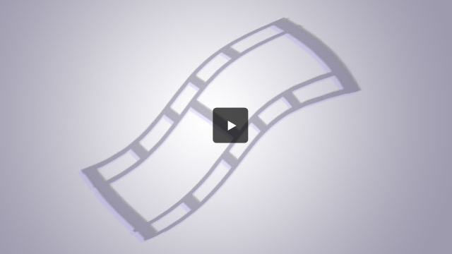

<!DOCTYPE html PUBLIC "-//W3C//DTD XHTML 1.0 Transitional//EN" "http://www.w3.org/TR/xhtml1/DTD/xhtml1-transitional.dtd">
<html lang="en-US" xmlns="http://www.w3.org/1999/xhtml" dir="ltr">
<head>
	<title>Thank You | Ashraf Wani</title>
	<meta http-equiv="Content-type" content="text/html; charset=utf-8" />
	<link rel="shortcut icon" href="images/favicon.ico" />
	<link rel="stylesheet" href="css/style.css" type="text/css" media="all" />
</head>
<body class="generic">

	<!-- Main -->
	

		

			

				<h2>Thank You</h2>
				<h3>...Your request has been successfully submitted!</h3>
			

			

				

			

			

				

					
					

						
Thanks for all that you do.   Talk soon,

						
Ashraf Wani

					

					
&nbsp;

				

			

		

	

	<!-- End Main -->
	

</body>
</html>

